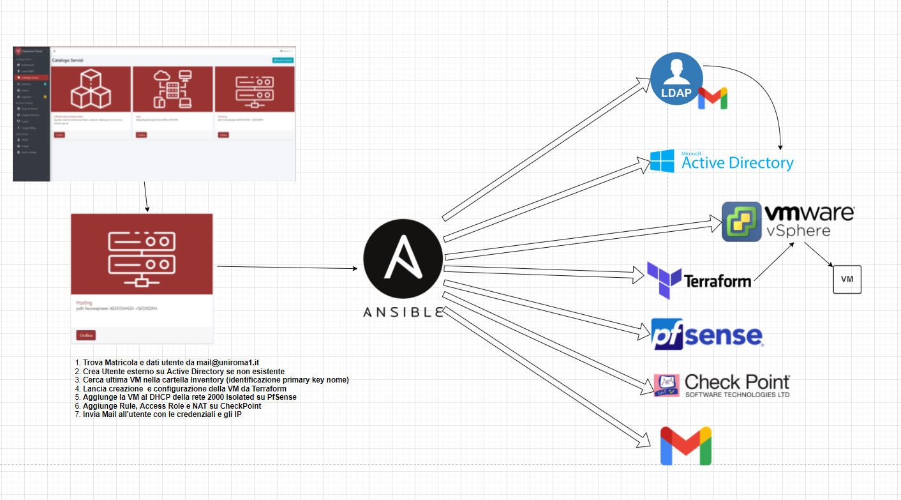

# Ansible_Cloud_Hosting_VM
Ansible Playbook with roles to create vm on vSphere, edit CheckPoint host,vpn,roles configuration, add dhcp on PfSense, find user on ldap, add it to Active Directory and send mail with the credentials

Available as Squest resource, uncomment the main.yml section to enable it

